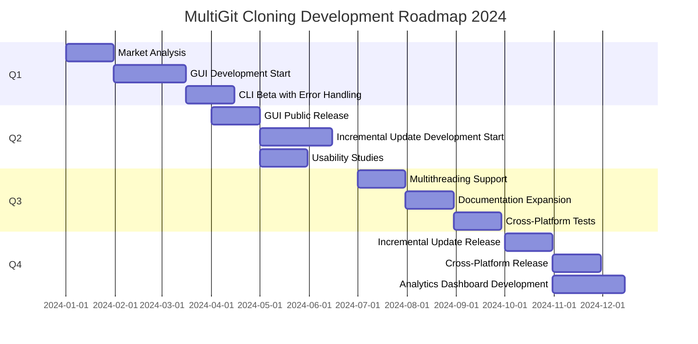

# identity
identity.multigit.com - multigit cloning for many different organization, branches, projects on github

**Title: MultiGit Cloning: Streamlined Repository Management for Diverse GitHub Projects**

**Description:**
MultiGit Cloning is an innovative utility designed to alleviate the burdens associated with managing multiple GitHub repositories across various organizations, branches, and projects. Engineered for developers, project managers, and teams, this tool automates the process of cloning repositories, ensuring a smooth and efficient workflow. With a focus on customization and scalability, MultiGit Cloning serves as a singular solution for synchronization and backup of GitHub codebases.

**Key Benefits:**

1. **Time Efficiency**: Batch clone operations minimize the time spent on manual repository setup.
2. **Organization**: Neatly arranges cloned repositories by organization and branch, enhancing structure in local environments.
3. **Consistency**: Maintains parallel structures between local directories and remote repositories, assuring workflow predictability.
4. **Flexibility**: Supports customized cloning strategies, catering to the specific needs of various development scenarios.
5. **Backup**: Aids in the creation of local repository backups to protect work against potential remote data loss.
6. **Collaboration**: Streamlines the initial setup process for new team members by quickly bringing their local environments in sync with current projects.
7. **Automation Integration**: Easily integrates with existing DevOps tools and pipelines, enabling scheduled or triggered cloning tasks.

**Room for Improvement:**

1. **GUI Interface**: Introduce a graphical user interface that can assist less technically-inclined users through the cloning process.
2. **Enhanced Error Management**: Develop robust error handling mechanisms to gracefully handle issues like network interruptions or repository access permissions.
3. **Incremental Update**: Implement a feature to only update changed files, conserving bandwidth and further hastening synchronization.
4. **Concurrent Cloning**: Adopt multithreading for simultaneous cloning of multiple repositories to capitalize on available system resources for speed improvement.
5. **Cross-Platform Compatibility**: Ensure seamless operation across different operating systems to reach a wider user base.

**Roadmap for 2024:**

Q1:
- Perform an in-depth market analysis to understand user needs and trends better.
- Begin development of the GUI, focusing on a clean and intuitive design.
- Release a CLI beta version featuring enhanced error management capabilities for select users.

Q2:
- Officially release the GUI version for public use, targeting non-technical audiences.
- Start implementing an incremental update feature in the CLI, following beta testing feedback.
- Conduct usability studies to refine both interfaces.

Q3:
- Roll out multithreading support for concurrent cloning and performance optimization.
- Introduce expanded documentation with comprehensive use cases and tutorials.
- Initiate cross-platform compatibility tests and address OS-specific issues.

Q4:
- Release the incremental update feature to reduce bandwidth usage and improve efficiency.
- Launch a full-fledged cross-platform compatible version of MultiGit Cloning.
- Develop an analytics dashboard for organizations to monitor usage patterns and operational metrics.

Throughout the year, the focus will be on gathering user feedback, refining existing features, ensuring robust security practices, and providing steady updates to support the latest GitHub features. By continuing to incorporate user insights into the development life cycle, MultiGit Cloning aims to evolve into a robust, inevitable tool in developers' and teams' arsenals worldwide.

